# 创建应用
## 登录开发者后台
  地址：https://oa.dingtalk.com
## 创建应用（以H5微应用为例）
  1. 登录钉钉[开发者后台](https://oa.dingtalk.com)，选择"应用开发"->"企业内部开发"->"H5微应用"，点击"创建应用"，开始创建企业自建微应用
  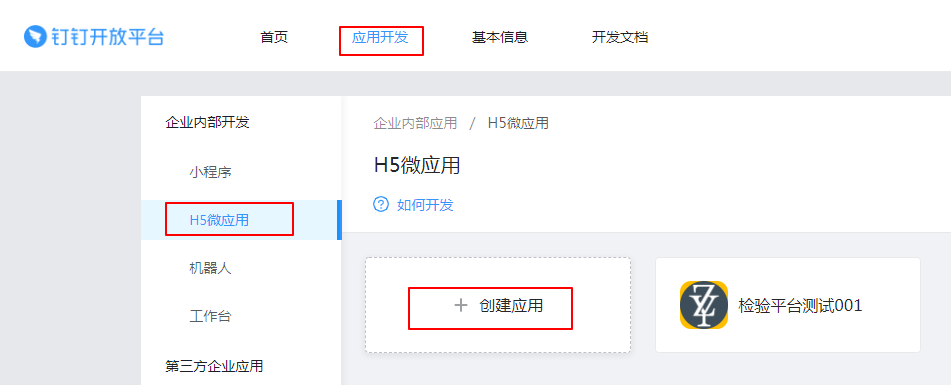
  2. 填写应用基本信息。包括应用名称、应用Logo和应用简介，选择"企业内部自主开发"，点击"下一步" 
  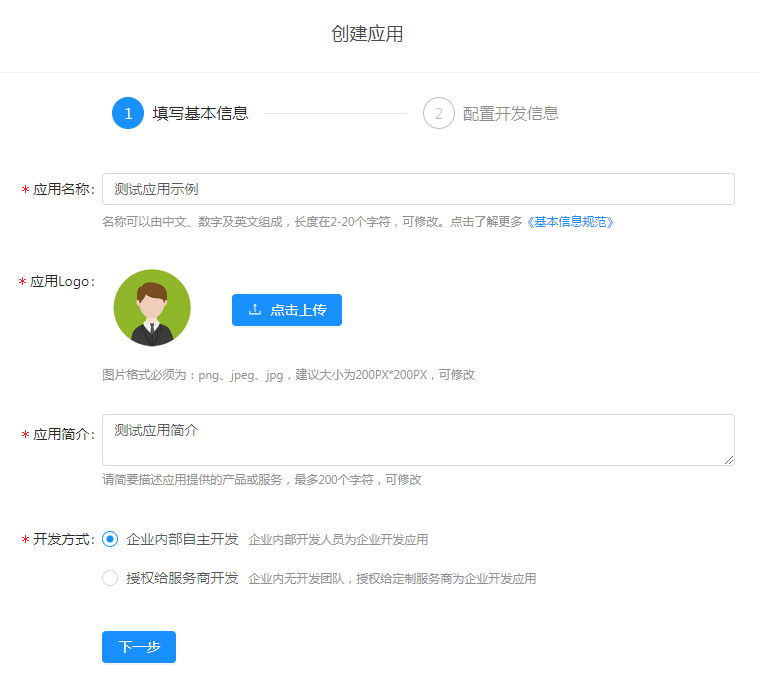
  3. 开发模式选择“开发应用”，开发应用类型选择“微应用”，应用首页链接填写H5微应用首页url，PC端首页地址填写pc端首页url，服务器出口IP填写本企业服务器的公网IP 
  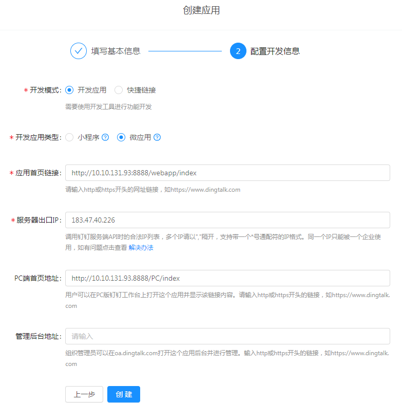

---------------
# 调试
## 开发调试包下载
  * [Android调试包](http://download.alicdn.com/wireless/dingtalk/latest/rimet_10006337.apk)（2020.3.10更新）
  * [Windows调试包](https://download.alicdn.com/dingtalk-desktop/win_installer/RC/DingTalk_v5.5.5-RC.5605.exe)

## Windows调试工具
  **1. 调试应用添加为APPOPS和开发负责人**
  * 登陆[开发者后台](https://oa.dingtalk.com)，选择“应用开发”-“企业内部开发”或“第三方企业应用”-“H5微应用”，点击您创建的微应用，如下图所示：
  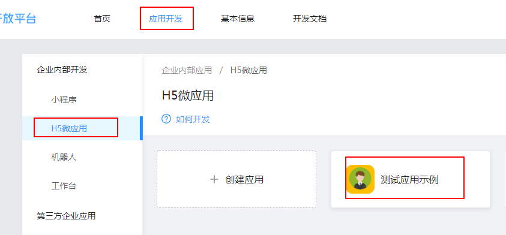
  * 选择“稳定性管理”，将开发者添加为APPOPS和开发负责人
  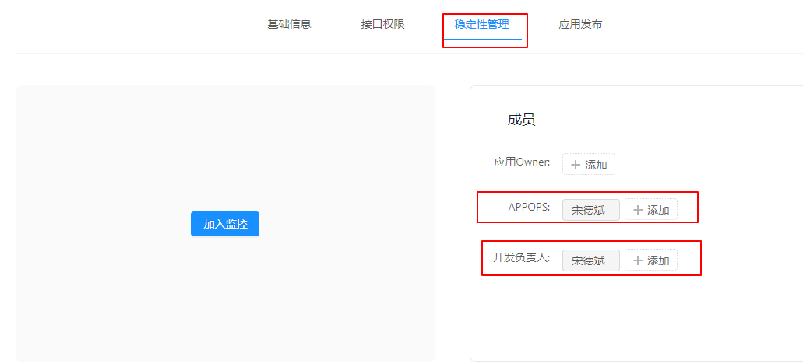
  * **注意：将开发者添加为应用开发人员后，需关闭PC客户端控制台，重新打开后生效，即具有调试权限**

  **2. Windows端调试方式**
  1. 启动钉钉开发版本（钉钉RC）
  2. 打开工作台面板 
  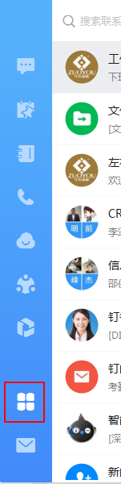
  3. 切换工作台面板顶部的企业，将企业切换到包含要调试的微应用的组织 
  4. 在工作台应用列表中找到需要调试的微应用，点击微应用图标打开微应用页面 
  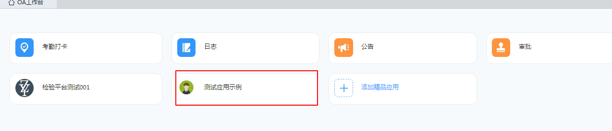
  5. 在微应用页面，鼠标右键点击该微应用，然后按F12，即可打开微应用调试面板 
  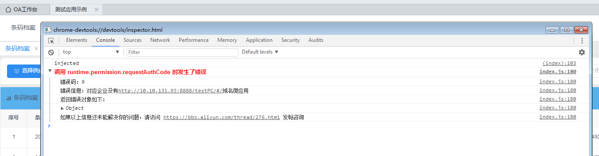

## Android调试工具
  1. **调试应用添加为APPOPS和开发负责人**
  * 登陆[开发者后台](https://oa.dingtalk.com)，选择“应用开发”-“企业内部开发”或“第三方企业应用”-“H5微应用”，点击您创建的微应用，如下图所示：
  
  * 选择“稳定性管理”，将开发者添加为APPOPS和开发负责人
  
  2. **Android端调试方式**
  1. 下载开发者调试包安装到手机
  2. 在手机上打开H5调试开关
  3. 打开钉钉设置页面
  4. 点击“通用”
  5. 打开“开发者选项”页面
  6. 打开“微应用调试”
  7. 手机连接到电脑，打开chrome，chrome://inspect 开始调试。

## 钉钉Api调试
  详情请进入[这里](https://open-dev.dingtalk.com/apiExplorer), 使用钉钉提供的API Explorer.

----------------
# 开发
## 引用js （两种方式二选一）
#### 使用npm安装
```
  // 下载
  npm install dingtalk-jsapi --save
  ...
  // 引用
  import * as dd from 'dingtalk-jsapi'; // 此方式为整体加载，也可按需进行加载
```
#### 浏览器引入
```
  <script src="https://g.alicdn.com/dingding/dingtalk-jsapi/2.7.13/dingtalk.open.js"></script>
```
##  JSAPI鉴权配置
  钉钉提供的JSAPI有很多是手机的基础能力，对这些JSAPI的调用不需要进行鉴权（即不需要进行dd.config），只需要保证在dd.ready里面调用即可。对于一些钉钉业务相关、安全相关的JSAPI的调用，需要开发者先进行鉴权然后再调用。

  了解JSAPI是否需要鉴权，请查看[JSAPI列表总览](https://ding-doc.dingtalk.com/doc#/dev/swk0bg)。
## JSAPI鉴权(以企业内部应用为例)
#### 获取appKey和appSecret
  * 登陆[开发者后台](https://oa.dingtalk.com)，选择“应用开发”-“企业内部开发”或“第三方企业应用”-“H5微应用”，点击您创建的微应用，如下图所示：
  
  * 点击“应用开发”-“企业内部应用”-找到应用并点击应用图标-点击“查看详情”，可以查看AppKey和AppSecret。
  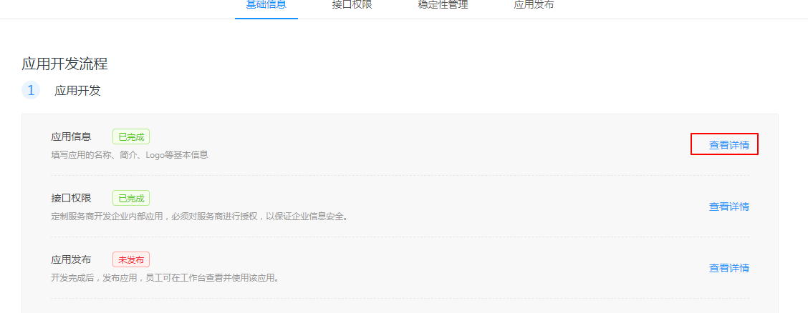
  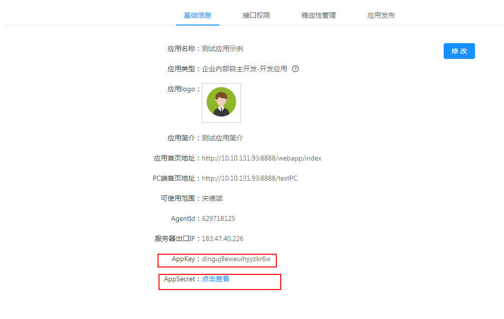
#### 获取access_token
  通过调用 “获取access_token的接口”[^1]获取企业的access_token, 其中appkey和appsecret分别对应之前取的值。
#### 获取jsapi_ticket
  * 通过调用 “获取jsapi_ticket的接口”[^2]获取企业的jsapi_ticket, 其中access_token对应之前取的值。
    > **注意：**
    > * 当jsapi_ticket未过期时，再次调用 “获取jsapi_ticket的接口”[^2]会获取到一个全新的jsapi_ticket（和旧的jsapi_ticket值不同），这个全新的jsapi_ticket的过期时间是2小时
    > * jsapi_ticket是一个appKey对应一个，所以在使用的时候需要将jsapi_ticket以appKey为维度进行缓存下来（设置缓存过期时间2小时），并不需要每次都通过接口拉取
[^1]: https://oapi.dingtalk.com/gettoken?appkey=appkey&appsecret=appsecret
[^2]: https://oapi.dingtalk.com/get_jsapi_ticket?access_token=access_token
---------------------
#### 计算签名信息
  签名计算说明及示例请点击[这里](https://ding-doc.dingtalk.com/doc#/faquestions/hxs5v9)
#### JSAPI鉴权
```
dd.config({
  agentId: '', // 必填，微应用ID
  corpId: '',//必填，企业ID
  timeStamp: '', // 必填，生成签名的时间戳
  nonceStr: '', // 必填，生成签名的随机串
  signature: '', // 必填，签名
  type:0/1,   //选填。0表示微应用的jsapi,1表示服务窗的jsapi；不填默认为0。该参数从dingtalk.js的0.8.3版本开始支持
  jsApiList : [
      'runtime.info',
      'biz.contact.choose',
      'device.notification.confirm',
      'device.notification.alert',
      'device.notification.prompt',
      'biz.ding.post',
      'biz.util.openLink',
  ] // 必填，需要使用的jsapi列表，注意：不要带dd。
});
```

## 免登流程
使用以下代码获取免登授权码（调用此api不需要进行鉴权，即不需要进行dd.config）。获取的免登授权码有效期5分钟，且只能使用一次。
```
dd.ready(function() {
  dd.runtime.permission.requestAuthCode({
    corpId: _config.corpId, // 企业id
    onSuccess: function (info) {
      code = info.code // 通过该免登授权码可以获取用户身份
  }});
});
```
-----------------
# 发布
新创建的应用，应用共两种状态，分别是：
1. 未发布状态：若人员在可使用范围内，可使用应用进行开发过程中体验与测试，且最多可添加20个可使用人员。
2. 发布状态：可使用人员人数无限制，可根据需要设置。

* 当应用经过测试后，开发者可在应用发布页面发布应用，点击确认发布。如下图所示：
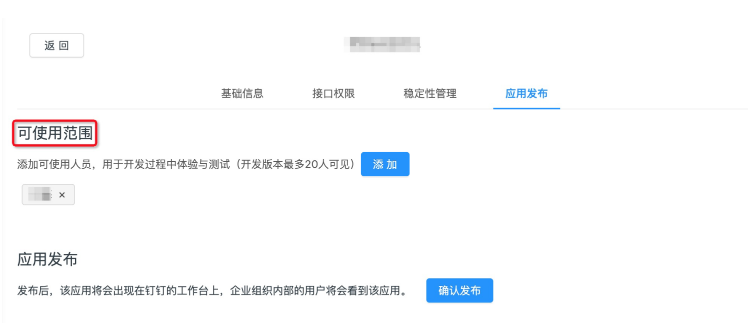
* 点击确定，如下图所示：
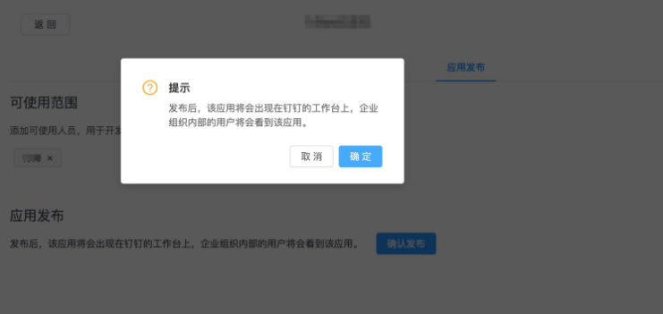
* 应用发布成功后，可修改应用可使用范围。可见范围可以设置全部员工、部分员工或者仅限管理员，如下图所示：
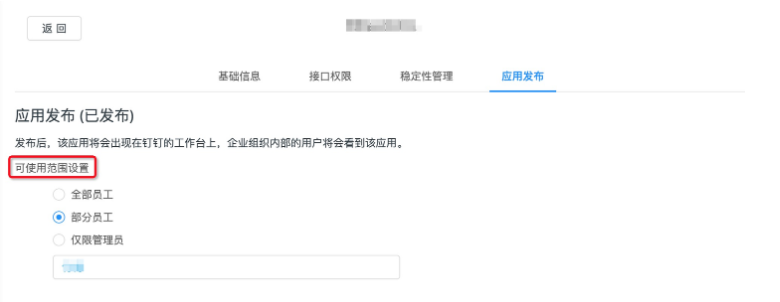


# 引用说明
> 此文档引用自 https://ding-doc.dingtalk.com/doc#/bgb96b/ok9au2
> 最后更新时间 2020-03-14